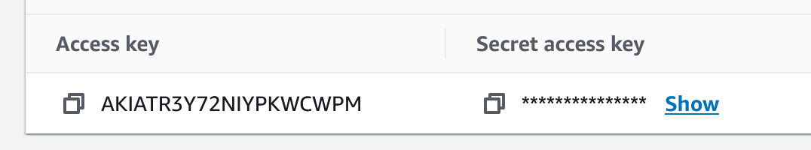
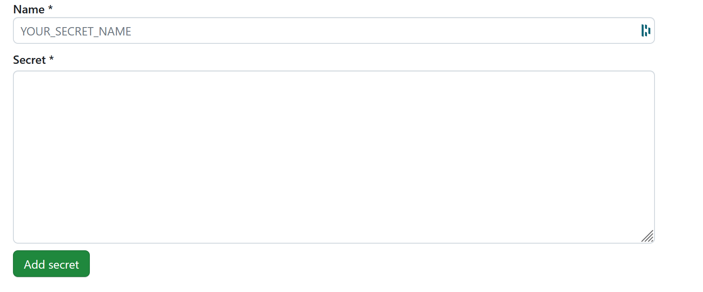

# BESVARELSE KANDIDAT 2012 DEVOPS EKSAMEN

## For at alt skal fungere med sensor

### GitSensoren må lage en kopi (fork) av følgende repository:
https://github.com/freebattie/devopsEksamen

### AWS 
Sensoren må logge inn på AWS-kontoen, navigere til IAM, der etter til "users", gå inn på sin bruker og velge "Create access key". Der etter velger man CLI, gir nøkkelen et navn og kopierer verdiene for Access key og Secret access key. Se vedlagt bilde av en gammel og deaktivert nøkkel!



Disse verdiene skal legges inn i GitHub Action secrets, som vil bli forklart nærmere nedenfor. Pass på å ikke lukke denne siden før du har lagt inn verdiene i GitHub og i cmd i oppgave1 B

Hvis sensor skal bruke egen S3 bucket for bilder eller kandidat-id-2012 er slettet så forklares dette lengre ned

### Github 
Sensoren må opprette 3 secrets ved å gå inn på sitt repository og velge: Settings > "Secrets and variables" > Actions > secrets Her skal sensor lage til 3 secrets:
- AWS_ACCESS_KEY_ID
- AWS_SECRET_ACCESS_KEY
- MAIL

Under "Name" for det første legger du inn "AWS_ACCESS_KEY_ID", og verdien "Access key" fra AWS som "Secret". Deretter trykker du på "Add secret". Deretter oppretter du en til med "AWS_SECRET_ACCESS_KEY" som "Name", og "Secret access key" fra AWS som "Secret". Se  



På mail så legger du inn mailen som du vill alarmen i oppgave 4 skal testes mot. 

Sensoren må opprette 8 stk variabler ved å gå inn på sitt repository og velge: Settings > "Secrets and variables" > Actions > variables  
Her må alt endres til unike verdier hvor det trengs hvis det skal deployes som ny applikasjon
- AWS_REGION - eu-west-1
- BUCKET_NAME - kandidat-id-2012
- IMAGE_CONTAINER - 244530008913.dkr.ecr.eu-west-1.amazonaws.com/student2012-private

- PREFIX - kandidat_2012
- S3_ARTIFACT - kandidat-id-2012
- S3_IMAGE_BUCKET - imagekadidat2012
- STACK_NAME - samKandidat2012PPE

AWS_REGION - hvilken region  
BUCKET_NAME - namn på bucket å bruke for det meste tingene  
IMAGE_CONTAINER -  ECR som skal brukes (du må lage dette manuelt inne på AWS hvis du ikke bruker studentens ECR)  

PREFIX - som skal legges på for å hjelpe for unike navn  
S3_ARTIFACT - hvor SAM skal lagre sin kofigurasjon  
S3_IMAGE_BUCKET - Legg inn en unik bucket navn som ikke finnes for å skanne bilder  
STACK_NAME - Legg inn et unikt app navn som ikke finnes  

### GitHub ACTION 
Sensor kan endre på følgendes om ønskes:
for terraform_apprunner_deploy_aws.yml:
- ALARM_LOGIN_THRESHOLD: 2 - endr på denne om du vill øke antall forsøk som skal være lov
- METRIC_NAME: unauthorized_scan_attempts.count - skift om du vill måle en annen verdi med varsel til dømes antall folk i bygget

### Terraform
Sensor må også endre på infra/provider.tf hvis han skal deploye selv, denne bucketen må være laget før terraform kan kjøre, hvis sensor har valgt å teste sin egen deploy så kan han bruke samme bucket her som i BUCKET_NAME da den blir manuelt laget ved å kjøre create_bucket_and_copy_images_manual.yml(se Deploy for Sensor)
bucket = "kandidat-id-2012"
key = "kandidat-id-2012/apprunner-a-new-state.state"
region = "eu-west-1"

### Deploy for Sensor
Etter å ha gjort alle desse endringene må sensor manuelt kjøre create_bucket_and_copy_images_manual.yml fra github actions slik at buckets,mapper blir laget og blider blir kopiert over. Dette er for å slippe å gjøre mye manuelt arbeid med å lage mapper og kopiere filer over til mappene.
etter det kan man lage en ny gren å pushe den, det vil kjøre build på sam og apprunner. Han kan da videre ta en Pull request til main å se at build og deploy virker på sam og apprunner. Eller han kan manuelt starte de 3 github action fra github, create_bucket_and_copy_images_manual.yml skal kun kjørese en gang for å sette opp nødvedige s3 buckets.


## OPPGAVE 1 A
Jeg har endret API-kallet fra /hello til /check. Det er også gjort andre tilpasninger i template-filen for å tydeligere gjenspeile funksjonaliteten.
Jeg har laget 2 work flows som heter sam_deploy_main.yml og sam_deploy_main.yml.
Så lenge man har lagt inn alle variabler og secrets på github under  Settings > "Secrets and variables" så skal alt fungere
 

## OPPGAVE 1 B
Filen ligger i mappen Kjell/hello_world, ga den først et nytt navn men skiftet tilbake i tilfelle automatiske tester. Du må manuelt skifte ut XXX, YYY og kjellsimagebucket med sensors hemmeligheter og s3 bucket med bilder:
```
docker build -t kjellpy .
docker run -e AWS_ACCESS_KEY_ID=XXX -e AWS_SECRET_ACCESS_KEY=YYY -e BUCKET_NAME=kjellsimagebucket kjellpy
```

## OPPGAVE 2 A
Dockerfilen ligger i root folder. Du må manuelt skifte ut XXX, YYY og kjellsimagebucket med sensors hemmeligheter og  s3 bucket.
hvis du skal teste alle endepunktene så må bucket du bruke være samme som den du la inn i BUCKET_NAME lengre oppe å du må ha manuelt kjørt create_bucket_and_copy_images_manual.yml
Har laget til slik at BucketName param er optional, hvis det ikke skrives inn så brukes BUCKET_NAME på begge PPE endepunktene, se API lengre nede for liste av endepunkter. 
```
docker build -t ppe .
docker run -p 8080:8080 -e AWS_ACCESS_KEY_ID=XXX -e AWS_SECRET_ACCESS_KEY=YYY -e BUCKET_NAME=kjellsimagebucket ppe
```

## OPPGAVE 2 B
mitt ECR er student2012-private

## OPPGAVE 3 A
Alle verdier ligger nå inne på github under  Settings > "Secrets and variables"  som sensor også må lage, Forklart i starten av filen.

## OPPGAVE 4
mapper i s3 bucket:
- camera/pictures - her skal alle bilder ligge inkludert en kopi av bilder som blir lagt inn i employee. Dette er kun for at simuleringen skal fungere.
- camera/employee - her skal det ligge bilder av alle som er ansatt i bedriften.
- camera/private - mappen som kunden bruker for å laste opp bilder fra private innganger.
- camera/entrance - mappen som kunden bruker for å laste opp bilder fra offentlig inngangs kamera.
- camera/exit - mappen som kunden laster opp bilder fra utgangskameraet.
Desse blir automatis laget når man kjører create_bucket_and_copy_images_manual.yml fra github action den vil også kopiere bilder over 

### Funksjonalitet RekognitionController:
I tilegg til det orginale så laget eg et For å gi bedriftene mer fleksibilitet, med muligheten til å bestemme hvilken kroppsdeler den skal skannes for verneutstyr. Da kan man sjekke om man har på seg hjelm i noen områder og ansiktsbeskyttelse i andre. gir samme respons som det orginale endpointet.

### Funksjonalitet CameraController:
Lagt til 3 nye endpoints, det første er for å sjekke om en person er ansatt eller ikke på en privat ingang, for å teste denne så kjører du :
```
curl 'localhost:8080/scan-private-entrance-automatic'
```
Denne vil kopiere et bilde fra camera/pictures eller fra camera/employee(random) å sammenligne det med bilder i camera/employee for å sjekk om det er en ansatt eller ikke å retunere en respons i formatet
```
{
isEmployee:true,
faceId:"sadlas-adasd-asdasd",
externalImageId:"stine.jpg",
similarity:100,
enter: "date and time enter building",
leave:"time he left or null if still in"
}
```
De 2 andre er for å skanne personer som går inn på kunde ingangen og alle som går ut av bygget, du tester ved å kjøre 
```
curl 'localhost:8080/scan-public-entrance-automatic'
```
og
```
curl 'localhost:8080/scan-exit-automatic'
```
Responsen er samme som over uten om hvis bygningen er tom da får du tilbake "Building is empty". Du kan teste alle desse endpointene med å manuelt laste opp bilder til det forskjellige mappene å så kalle på manuelle endpoints. se under for alle endpoints.

### API:
Under finner du alle API endepunktene husk å skift ut localhost:8080 med aws adressen hvis du skal teste mot det som kjører på aws.
- Get /scan-private-entrance-automatic
```
curl 'localhost:8080/scan-private-entrance-automatic'
```
- Get /scan-private-entrance-manual
```
curl 'localhost:8080/scan-private-entrance-manual'
```
- Get /scan-exit-manual
```
curl 'localhost:8080/scan-exit-manual'
```
- Get /scan-exit-automatic
```
curl 'localhost:8080/scan-exit-automatic'
```
- Get /scan-public-entrance-manual
```
curl 'localhost:8080/scan-public-entrance-manual'
```
- Get /scan-public-entrance-automatic
```
curl 'localhost:8080/scan-public-entrance-automatic'
```
- GET /scan-ppe
```
curl 'localhost:8080/scan-ppe?bucketName=<din bucket>'
```
- Get /scan-custom-ppe
```
curl 'localhost:8080/scan-custom-ppe?bucketName=<din bucket>&ppe=<HAND_COVER | HEAD_COVER | FACE_COVER>'
```

### Måling
Jeg har laget 3 gauges som viser følgende:
- Antall ansatte i bygget.
- Antall besøkende i bygget.
- Totalt antall personer i bygget.

Dette er for å holde kontroll på hvor mange folk som er i bygget, for eksempel om bygget er tomt for besøkende etter stengetid eller under en alarm, eller om det er for mange folk i bygget.

Av Metric counters har jeg laget følgende:
- Antall ganger en skanning har feilet på rad (denne bruker jeg senere til alarm). Dette er slik jeg kan oppdage problemer med scanningen eller om folk prøver å bryte seg inn.

Av Timer måler jeg følgende:
- Tiden originalenpointet bruker og tiden automatiske ansiktskjenningsenpoint bruker.
- Tiden hver hovedmetode i automatisk ansiktsenpoint bruker.

Disse er for å se etter problemer hvis ting begynner å gå sakte, eller om det er områder hvor vi kan forbedre koden slik at det går raskere.

Av DistributionSummary måler jeg følgende:
- Jeg setter tiden når en person kom inn og når han går ut igjen av bygget. Dette gir meg innsikt i når på døgnet folk oppholder seg i bygget og hvor lenge de er der.

## OPPGAVE 4. Drøfteoppgaver
### A. Kontinuerlig Integrering
I DevOps-konteksten handler CI om å hyppig merge egen kode til et sentralt repository med automatisk bygge- og testprosesser, for eksempel ved bruk av GitHub Actions og Terraform for infrastrukturbygging.

Ved å utføre hyppige merges oppdages feil tidlig, noe som tillater rask retting og dermed forbedrer kodekvaliteten. Hyppige commits minimerer konflikter som kan oppstå når flere jobber samtidig.

I GitHub bruker man ofte å konfigurere hovedgrenen (main) til å kreve pull requests før endringer tillates. Dette bidrar til bedre kontroll. Utviklere oppretter grenser for individuelle arbeider, og gjennomfører pull requests fra disse grenene til main etter å ha løst eventuelle konflikter. Man stopper også at kode som feiler under bygging og testing ikke kan merges inn i main. Dette fører til at man oppdager feil raskere, samtidig som man ikke påvirker resten av teamet dersom commits skulle feile.

Ved bruk av kontinuerlig merging og regelmessig pull fra main reduserer man konflikter, øker kodekvaliteten og reduserer tiden det tar å løse små problemer hver gang. Dette tillater fokus på forbedring av koden.

### B. Sammenligning av Scrum/Smidig og DevOps fra et Utviklers Perspektiv

I denne oppgaven skal du som utvikler reflektere over og sammenligne to sentrale metodikker i moderne programvareutvikling: Scrum/Smidig og DevOps. Målet er å forstå hvordan valg av metodikk kan påvirke kvaliteten og leveransetempoet i utviklingen av programvare.

#### Scrum/Smidig Metodikk:

Vi gjennomførte nylig en eksamen i Smidig med bruk av Scrum, hvor vi jobbet mot Munch. Det jeg la merke til med denne tilnærmingen var det sterke fokuset på kunden. Bruken av "user stories" gjorde det tydelig hva kunden ønsket og hva vi måtte utvikle. Mye tid gikk til møter som sprint planlegging, standup, sprint gjennomgang og retrospektiv sprint. I starten av en sprint, når vi hadde valgt hvilke user stories som skulle løses, var det lite rom for tilpasning. Dette fungerte greit så lenge alt gikk etter planen, men når ting oppsto, så vi hvordan effektiviteten ble påvirket.

#### DevOps Metodikk:

DevOps bygger på tre grunnleggende prinsipper: flyt, tilbakemelding (feedback) og kontinuerlig forbedring.

#### Flyt:

Dette prinsippet fokuserer på kontinuerlig integrasjon, vanligvis gjennom verktøy som Git og for eksempel GitHub. Det sikrer hyppige "commits" av kode og automatisering gjennom GitHub Actions, noe som automatiserer bygging, testing og distribusjon av programvaren. Samarbeid fremmes for å minimere feil som oppstår i forskjellige miljøer.

#### Tilbakemelding (Feedback):

Feedback innebærer bruk av telemetri for å måle infrastrukturen, oppdage og håndtere problemer ved økt trafikk eller nedetid i tjenester. Overvåking av skybaserte løsninger og måling av virkningen av forretningsendringer er også viktig. Feedback inkluderer også varsler via e-post eller telefon, logging for å spore og analysere hendelser, og A/B-testing for å evaluere hva som fungerer best blant kunder.

#### Kontinuerlig Forbedring:

Dette prinsippet fokuserer på å bygge en kultur for deling av erfaringer, verktøy, ideer og løsninger. Gjennom praksiser som "blameless postmortems" identifiserer team feil uten å peke finger eller legge skyld på enkeltpersoner. Dette fører til kontinuerlig læring og forbedring gjennom hele prosessen.

DevOps, når det implementeres på riktig måte, integrerer utvikling og drift på en måte som kan ha betydelig innvirkning på kvaliteten og leveringstempoet av programvare. Imidlertid kommer dette ikke uten utfordringer. En av de største utfordringene er å skape den nødvendige kulturen for samarbeid og kontinuerlig forbedring, da det kan være utfordrende å få ulike team til å samarbeide sømløst og omfavne endringer i praksis og verktøy.

#### Analyse:

DevOps handler om å gi teamet en større følelse av ansvar, noe som resulterer i økt eierskap til det som leveres. Dette fører igjen til en forbedring av den koden som leveres. Gjennom bruken av flyt identifiserer man feil raskt, og automatisering av prosessene bidrar til økt hastighet i leveransene. Med effektiv tilbakemelding oppdages problemer raskt, også etter at de har oppstått. Disse metodene muliggjør rask feilretting og problemoppfølging.

Denne tilnærmingen gjør at teamet kan arbeide mer effektivt, siden alt skjer i iterasjoner og prosessene er automatiserte. Kontinuerlig forbedring bidrar til å hjelpe teamet med å stadig forbedre seg og bli bedre som en samlet enhet.

#### Sammenligning og Kontrast:

Smidig fokuserer på iterativ utvikling og kundebehov gjennom hele prosessen. Dette kan resultere i bedre tilpasning til kundebehov, men endringer midtveis i en iterasjon kan påvirke kvaliteten hvis ikke godt håndtert. Leveringstempoet er bestemt av iterasjonene (sprinter) og kan gi en forutsigbar leveransefrekvens. Tilpasning til endringer kan imidlertid bremse tempoet.

DevOps fokuserer på automatisering, feedback og kontinuerlig forbedring. Dette kan bidra til raskere oppdagelse og retting av feil, noe som vanligvis forbedrer programvarens pålitelighet og kvalitet. Dette kan akselerere leveransene. Men implementering av DevOps-kulturen kan kreve tid og ressurser.

Scrum/Agile passer best når kundens krav endres ofte og man har klare krav, mens DevOps passer bedre når det er behov for kontinuerlig forbedring, hurtigere feilretting og konstant tilpasning av infrastruktur og kode. Det er egnet for prosjekter med fokus på stabilitet og pålitelighet.
## C. Det Andre Prinsippet - Feedback

Tenk deg at du har implementert en ny funksjonalitet i en applikasjon du jobber med. 
Beskriv hvordan du vil etablere og bruke teknikker vi har lært fra "feedback" for 
å sikre at den nye funksjonaliteten møter brukernes behov. Behovene 
Drøft hvordan feedback bidrar til kontinuerlig forbedring og hvordan de kan integreres i ulike stadier av   
utviklingslivssyklusen.

For å sikre at applikasjonen fungerer som forventet når det gjelder kostnader og ytelse, er det nyttig å bruke forskjellige verktøy og metrikker. For eksempel kan man sette opp alarmer og logging i AWS for å overvåke kostnader og ytelse. Metrikker som CPU-bruk, minnebruk og trafikkflyt kan også brukes til å sette opp alarmer for automatisk skalering. I tillegg kan man legge til metrikker direkte i koden, for eksempel ved å bruke Micrometer for Java, for å måle ytelse og trafikk.

Samlingen av denne informasjonen i et dashboard lar utviklingsteamet kontinuerlig få feedback, identifisere manglende datapunkter og optimaliseringsmuligheter. Å inkludere metrikker i koden for å måle antall kall på endepunkter er også nyttig, spesielt når man sammenligner det nye endepunktet med eksisterende endepunkter.

Det er viktig å raskt oppdage feil eller uventet oppførsel i applikasjonen. Alarmer og logging spiller en nøkkelrolle i å varsle når noe går galt, og det er avgjørende å ha et system på plass for å varsle riktig person eller team.

Å samle feedback gjennom hele prosessen er kritisk. Det starter med å sikre at applikasjonen kjører som forventet, deretter overvåker man med alarmer og logging. Når applikasjonen blir tatt i bruk, kan man oppdage behovet for bedre eller flere målinger for å bedre forstå brukeradferd.

Dette kan man oppnå me  A/B-testing. Feedback er en konstant prosess som begynner med å sikre at applikasjonen fungerer og deretter tilpasse seg brukernes behov og atferd gjennom hele utviklingslivssyklusen.


